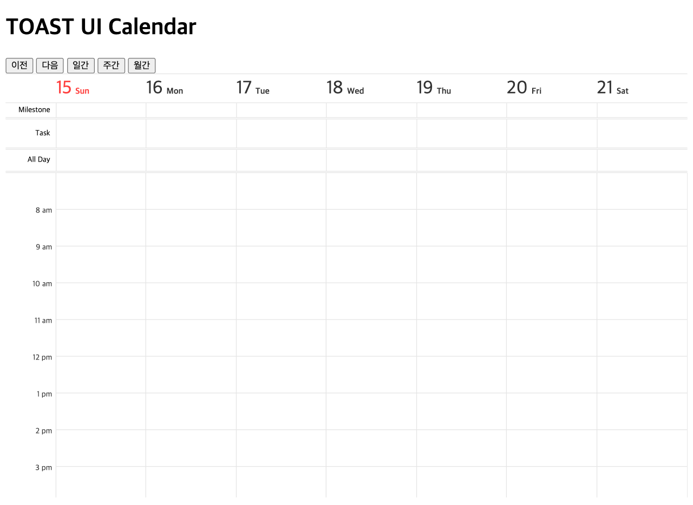

##############################
캘린더 생성하기
##############################

HTML 초기 코드 작성
==============================

준비된 ``src/index.html`` 파일을 열어 ``body`` 태그 내부에 컨테이너 태그를 작성해 줍니다.

.. code-block:: html

  // src/index.html

  <body>
    ...
    

    ...
  </body>

자바스크립트 초기 코드 작성
==============================

1. 인스턴스를 생성해봅니다. 이 때 반드시 기본 옵션을 파라미터로 넘겨주어야 합니다.
``src/index.js`` 파일을 열고 다음 코드를 추가해봅니다.

* 인스턴스 생성 시 넘겨주는 파라미터
    * 첫번째 파라미터 - 캘린더가 생성되는 컨테이너 엘리먼트 지정
        * 예) ``document.getElementById('calendar')``, ``'#calendar'``
    * 두번째 파라미터 - 캘린더 옵션 정보
        * ``defaultView`` : 캘린더 초기 뷰 타입 지정 (``'month'``, ``'week'``, ``'day'``)

* 더 많은 옵션 보기 : |link|

.. |link| raw:: html

  <a href="https://nhn.github.io/tui.calendar/latest/Options" target="_blank">링크</a>

.. code-block:: javascript

  // src/index.js

  import Calendar from 'tui-calendar';
  import 'tui-calendar/dist/tui-calendar.css';
  import 'tui-date-picker/dist/tui-date-picker.css';
  import 'tui-time-picker/dist/tui-time-picker.css';

  const container = document.getElementById('calendar');
  const options = {
    defaultView: 'week'      // 캘린더가 초기에 그려지는 뷰 타입을 주간뷰로 지정
  };

  const calendar = new Calendar(container, options); // 캘린더 인스턴스 생성

2. 인스턴스를 생성하는 코드 아래에 API를 호출하는 코드를 추가해봅니다.

* API 보기 : |API|

.. |API| raw:: html

  <a href="https://nhn.github.io/tui.calendar/latest/Calendar#changeView" target="_blank">링크</a>

이동 및 뷰 타입 변경 버튼의 이벤트 핸들러에 캘린더의 API를 호출해 보도록 하겠습니다.
캘린더 인스턴스 생성 후 동적으로 캘린더의 뷰를 변경할 수 있어요.

이번 장에서는 이벤트만 등록해 놓고, 자세한 내용은 |5장| 에서 다룹니다.

.. |5장| raw:: html

  <a href="./05.html" target="_blank">5장. 캘린더 설정하기</a>

.. code-block:: javascript

  ...

  /* 이동 및 뷰 타입 버튼 이벤트 핸들러 */
  ...
  nextBtn.addEventListener('click', () => {
    calendar.next();                          // 현재 뷰 기준으로 다음 뷰로 이동
  });

  prevBtn.addEventListener('click', () => {
    calendar.prev();                          // 현재 뷰 기준으로 이전 뷰로 이동
  });

  dayViewBtn.addEventListener('click', () => {
    calendar.changeView('day', true);         // 일간 뷰 보기
  });

  weekViewBtn.addEventListener('click', () => {
    calendar.changeView('week', true);        // 주간 뷰 보기
  });

  monthViewBtn.addEventListener('click', () => {
    calendar.changeView('month', true);       // 월간 뷰 보기
  });

3. 개발 서버에 접속한 브라우저에서 캘린더가 생성되었는지 확인합니다.
코드를 수정하면 브라우저는 자동으로 리프레시됩니다.

결과 화면
==============================

