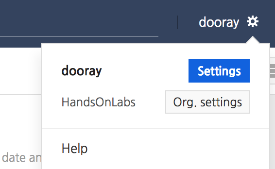
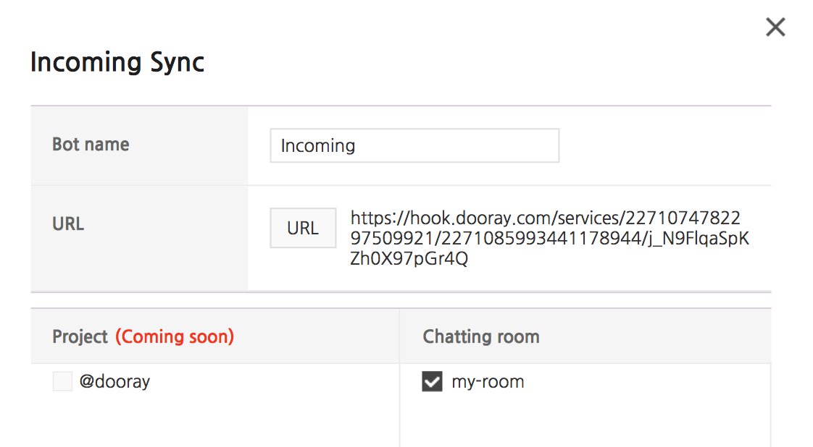
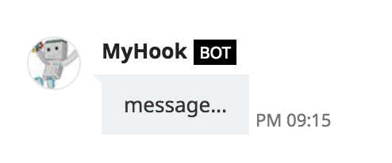

###################
간단한 메시지 전송하기
###################

메신저 채널의 URL 구하기
=====================

Dooray! 개인 설정에서 서비스 연동 탭으로 이동합니다.

.. image:: _static/img4.png
    :scale: 50%

연동 탭에서 맨 아래 'Incoming'을 추가합니다.

다음과 같은 폼에서 방금 만든 'my-room' 대화방을 체크하고 저장하면 클립보드에 해당 대화방을 가리키는 URL이 복사됩니다. 이 URL은 다음 단계에서 메시지를 전송할 때 사용합니다.

.. code-block:: text

    https://hook.dooray.com/services/227107.../j_N9Fl...

메시지 전송하기
=================

전송할 때 사용하는 최소 포맷은 다음과 같습니다.

.. code-block:: json

    {
        "botName": "MyHook", 
        "botIconImage": "https://translate.nhnent.com/icon/botimage.jpg", 
        "text":"message..."
    }

리눅스를 사용하고 있다면 `curl`을 이용하여 손쉽게 전송할 수 있습니다.

.. code-block:: bash

    curl -H "Content-Type: application/json" -X POST -d '{"botName": "MyHook", "botIconImage": "https://translate.nhnent.com/icon/botimage.jpg", "text":"message..."}' https://hook.dooray.com/services/2271074782297509921/2271085993441178944/j_N9FlqaSpKZh0X97pGr4Q

실행을 하면 다음 화면을 보실 수 있습니다.

실습 소스의 `./simple.sh`를 수정해서 메시지를 전송해보십시오.

.. literalinclude:: ../simple.sh
    :language: bash

1. `simple.sh`를 편집기에서 엽니다.
2. `hook_url`에 메시지를 전송할 대화방의 URL을 지정합니다.
3. 리눅스 명령창에서 `./simple.sh`를 실행합니다.

JSON 부분의 값 부분을 원하는 형태로 바꿔서 바뀌는 모습을 확인해보세요.

