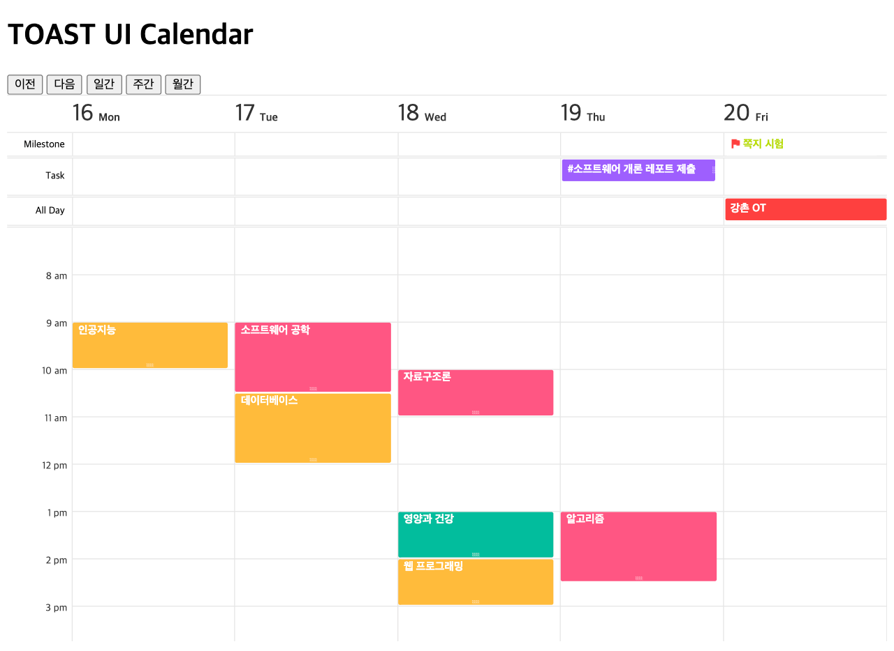

######################################
캘린더 설정하기
######################################

TOAST UI Calendar는 다양한 타입의 뷰를 제공합니다. 일간/주간/월간 뷰가 기본입니다. 일간/주간 뷰에서는 업무와 마일스톤 패널을 옵션에 따라 표시할 수 있고, 월간 뷰에서는 2~6주 뷰까지 기호에 맞게 다양하게 설정할 수 있습니다.

모든 뷰 타입은 초기화 옵션에서 지정할 수 있고 초기화 후에도 API를 사용하여 뷰 타입을 변경할 수 있습니다.

초기 뷰 타입 설정하기
==================================

``defaultView`` 속성은 초기 캘린더의 뷰 타입을 지정합니다. ``'day'``, ``'week'``, ``'month'`` 값을 입력하여 각각 일간/주간/월간 뷰 형태를 설정할 수 있습니다. ``defaultView`` 속성을 바꿔가며 브라우저에서 테스트해 보세요.

.. code-block:: js

  ...
  const calendar = new Calendar(container, {
    ...
    defaultView: 'day', // 'week', 'month'
    ...
  });

마일스톤/업무 영역 설정하기
==================================

``taskView`` 속성은 일간/주간 뷰에서 마일스톤/태스크 영역의 노출 여부를 설정합니다. 기본값이 ``true`` 이므로 여기서는 ``false`` 로 설정하여 마일스톤/태스크 영역이 보이지 않도록 하겠습니다.

.. code-block:: js

  ...
  const calendar = new Calendar(container, {
    ...
    taskView: false,
    ...
  });

Milestone과 Task 영역이 사라지고 일정 정보만 노출되는 것을 확인할 수 있습니다.

.. image:: _static/images/step05-2.png

태스크와 마일스톤 영역을 다시 보여주도록 ``taskView`` 를 ``true`` 로 설정해주세요.

주말 제외 설정하기
==================================

``workweek`` 속성은 주말 표시 여부를 설정합니다. 일간/주간/월간 뷰에서 지원되는 기능입니다. 기본값이 ``false`` 입니다.

.. code-block:: js

  ...
  const calendar = new Calendar(container, {
    ...
    month: {
      workweek: true
    },
    week: {
      workweek: true
    }
    ...
  });

토, 일요일이 사라진 것을 확인할 수 있습니다.

2~6주 뷰 설정하기
==================================

``visibleWeeksCount`` 속성은 **월간 뷰** 에서 표시할 주의 개수를 설정합니다. 기본값은 ``6`` 이며 `2~6` 까지 설정할 수 있습니다.

.. code-block:: js

  ...
  const calendar = new Calendar(container, {
    ...
    defaultView: 'month',
    month: {                        // 월간 뷰 옵션 설정
      visibleWeeksCount: 2          // 2~6까지 설정 가능
    }
    ...
  });

월간 뷰에서 2주만 표시됩니다.

.. image:: _static/images/step05-5.png

API로 뷰 타입 변경하기
==================================

초기 설정 후에도 ``changeView(viewType, forceRedraw)`` API를 사용하여 뷰 타입을 동적으로 변경할 수 있습니다.

여러분은 이미 이동 및 뷰 타입 변경 버튼에 이벤트 핸들러를 등록하면서 ``changeView`` API를 사용해보았습니다.

.. code-block:: js

  // 일간 뷰
  calendar.changeView('day', true);

  // 주간 뷰
  calendar.changeView('week', true);

  // 월간 뷰
  calendar.changeView('month', true);

  // 월간 2주 뷰
  calendar.setOptions({month: {visibleWeeksCount: 2}}, true);
  calendar.changeView('month', true);

여러분의 기호에 맞게 다양하게 캘린더 뷰 타입을 설정해 보세요!
